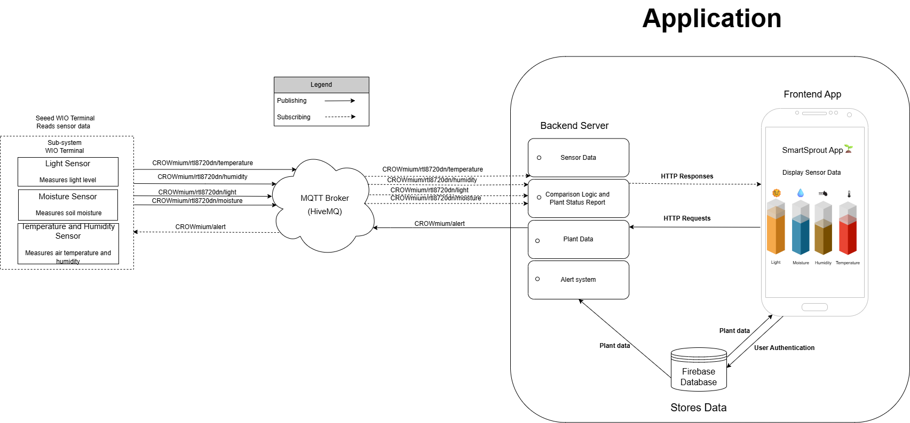

SmartSprout is an innovative smart plant monitoring system designed to help users keep their plants healthy effortlessly. It consists of two main components: a sensor device equipped with sensors to measure temperature, humidity, light, and soil moisture, and a mobile application that displays real-time data and alerts users when their plants need attention.

You can check out this video summary that highlights the motivation behind the project, the system’s key features, and a quick walkthrough of the mobile app interface.

SmartSrpout is a great project for anyone interested in learning about Wio terminals, sensor integration, MQTT connectivity, real-time data visualization, and mobile app development.

The mobile app is built using React Native and Expo, providing a dynamic user experience with modern UI components. The app is supported by the backend server, which is developed using Express.js, which handles API requests and manages communication with Firebase Firestore. Together, the frontend and backend create our application that allows users to monitor the plant’s health seamlessly.

Connectivity between the sensor device and the application is enabled through MQTT messaging, using the public HiveMQ as the broker, which implements the publish-subscribe communication pattern for efficient and scalable data transmission.

To securely store user data and plant information, the system uses Firebase Firestore, allowing user authentication, real-time synchronization, and data management.

For project automation and dependency management, we use the internal Expo builder for an automated build and maintain a CI/CD pipeline to ensure reliable builds and deployments.

## Getting Started
### Installation
- Download and install the [Arduino IDE](https://www.arduino.cc/en/software) to flash code to the microcontroller.
- Your IDE of choice for React Native(we recommend [VSCode](https://code.visualstudio.com/)).
- Download and install [Node.js](https://nodejs.org/en) which comes bundled with `npm`.
 
- Expo CLI(global install)
  Run the following command once to installl Expo CLI globally:

    ```bash
    npm install -g expo-cli
    ```
- Install Project Dependencies,
  From the root directory:

    ```bash
    npm install
    ```

### Running the App
- You can start the app in development mode by running the following from the project root directory:

    ```bash
    npm start
    ```
  The app can be run on a physical mobile device using the [Expo Go](https://expo.dev/go) app as long as it and the computer are on the same network or an IDE which has an integrated emulator like [Android Studio](https://developer.android.com/studio).

  Alternatively, as a user, you can simply download the [APK file](https://expo.dev/artifacts/eas/ppdvYRdy7mZx4NdxtPQ8xh.apk), install it on your Android device, and start using the app immediately.


### Libraries
- [Seeed_Arduino_rpcWiFi library](https://github.com/Seeed-Studio/Seeed_Arduino_rpcWiFi) - v1.1.0 by SEEED Studio
- [Seeed_Arduino_rpcUnified library](https://github.com/Seeed-Studio/Seeed_Arduino_rpcUnified) - v2.1.4 by SEEED Studio
- [Seeed_Arduino_mbedtls library](https://github.com/Seeed-Studio/Seeed_Arduino_mbedtls/tree/dev) - v3.0.2 by SEEED Studio
- [Seeed_Arduino_LCD library](https://github.com/Seeed-Studio/Seeed_Arduino_LCD) - v2.0.3 by SEEED Studio

### Wio Terminal & Sensors

## System Design 
The **SmartSprout** mobile app uses **Firebase Firestore** to store plant-specific metadata and user authentication. Firestore is a scalable, cloud-hosted NoSQL datbase that updated in real time across all devices.

---

The system is composed of the following core components:
- A **React Native** frontend built with **Expo**
- A **Node.js + Express** backend
- A **Firebase Firestore** cloud database
- MQTT integration via **HiveMQ** for real-time communication with IoT devices

The frontend and backend together form the complete application. The frontend handles all user interactions, while the backend manages data processing and serves as the bridge between Firebase, MQTT, and the app.




## Acknowledgements

The SmartSprout system is our project for the course **DIT114: Project - Systems Development** at the University of Gothenburg during the spring semester of 2025. We would like to thank the Department of Computer Science and Engineering for providing us with the necessary hardware, sensors, and resources to carry out this project.

A special thanks to our teaching assistants **Julia** and **Karl** for their continuous guidance and valuable feedback throughout the development process.

We also wish to acknowledge the [Quiet Quest](https://github.com/m-berggren/quiet-quest) project group from a previous iteration of a related course. Their well-documented repository served as an important reference and source of inspiration for our own development work.

We are also grateful to the online developer community, particularly **Reddit** and **Stack Overflow**, for helping us find answers to countless technical questions throughout the project.

Lastly, a huge thank you to **ChatGPT** for assisting us with explanations, debugging help, and technical writing support across every phase of development.

## Team

| <div align="center"></div> | <div align="center"></div> | <div align="center"></div> | <div align="center"></div> | <div align="center"></div> |
|----------------------------------------------------------------------------------------|---------------------------------------------------------------------------------------|-----------------------------------------------------------------------------------|-------------------------------------------------------------------------------------|---------------------------------------------------------------------------------------|
| **Vijaykrishnan Gopalakrishnan**                                                      | **Ulyana Harabets**                                                                   | **Rahat Mir**                                                                     | **Sumaya Omar**                                                                     | **Mirza Raian Ahmad**                                                                 |
| Made significant contributions to the frontend UI.                                    | Led frontend development, including UI design and Firebase integration for plant data storage. | Worked on login page and connected frontend to Firebase authentication database.     |  | Responsible for Arduino, Wio Terminal, sensor integration, and MQTT setup on hardware side. |
